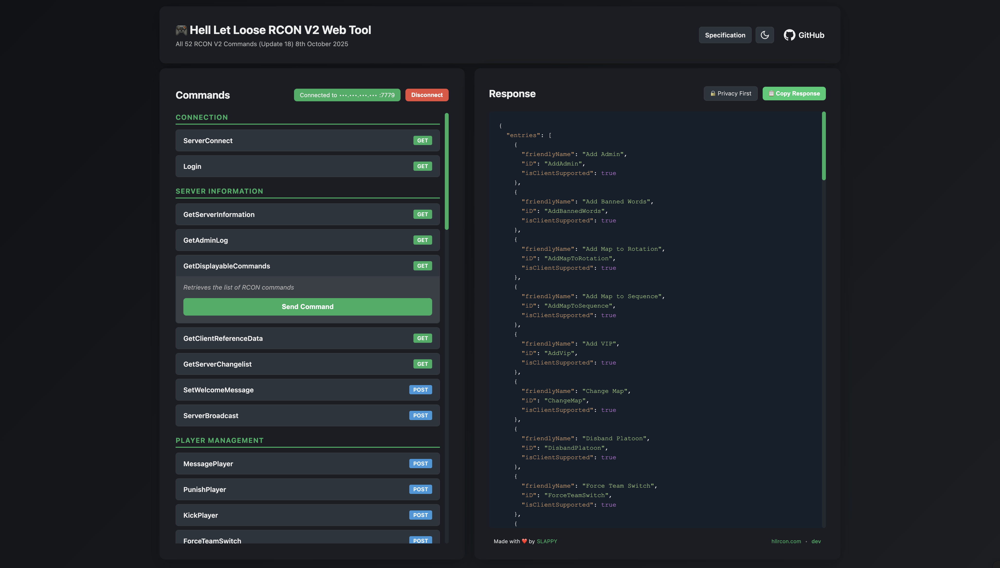

# HLLRCON

### A lightweight modern web interface and REST API wrapper for Hell Let Loose RCON protocol.

This project can be used in place of the official RCON client which only runs on Windows and has limitations. Developers can use this tool to inspect RCON commands and their responses. Third party tools can choose to leverage this REST API in place of the official RCON TCP protocl.



## 🚀 Quick Start

**Live Demo:** [https://hllrcon.com](https://hllrcon.com)

Connect to any HLL server instantly - no installation required!

> [!NOTE]
> Privacy-focused: No server credentials are logged or stored.

## 📡 RCON Protocol Version

This application implements **RCON V2 (Update 18)** with full support for all 52 commands:

- Player management (kick, ban, punish, message)
- Server settings (timers, balancing, vote kick)
- Map management (rotation, sequence, sector layout)
- Admin and VIP management
- Real-time server information

For complete protocol documentation, see [Hell Let Loose - Rcon V2-1.pdf](frontend/static/Hell%20Let%20Loose%20-%20Rcon%20V2-1.pdf)

## Installation

### Docker (Recommended)

```bash
git clone https://github.com/Sledro/hllrcon.git
cd hllrcon
docker compose up
```

Open <http://localhost:8080> and enter your server details.

**Pre-built image:**

```bash
docker run -p 8080:8080 ghcr.io/sledro/hllrcon:latest
```

### From Source (Requires Go 1.25.1+)

```bash
git clone https://github.com/Sledro/hllrcon.git
cd hllrcon
go mod download
go run ./cmd/hllrcon
```

Open <http://localhost:8080>

## What You Can Do

- 👤 Kick, ban, and punish players
- 💬 Broadcast messages and PM players
- 🗺️ Change maps and manage rotation
- 👑 Manage VIPs and admins
- ⚙️ Configure server settings
- 📊 View logs and player lists
- ...and all 52 RCON V2 commands!

## Configuration

The application uses `config.toml` for default settings:

```toml
[server]
host = "0.0.0.0"  # Bind address
port = "8080"     # HTTP port

[log]
level = "info"    # debug, info, warn, error
format = "text"   # text or json
```

You can also use environment variables:

- `HLL_SERVER_HOST` - HTTP bind address
- `HLL_SERVER_PORT` - HTTP port
- `HLL_LOG_LEVEL` - Log level
- `HLL_LOG_FORMAT` - Log format

## Architecture

```text
├── cmd/hllrcon/         # Application entry point
├── config/              # Configuration
├── rcon/                # RCON V2 protocol implementation
├── api/                 # REST API handlers & routes
├── session/             # Session management
├── frontend/            # Web UI
└── Dockerfile           # Docker configuration
```

## How It Works

1. **Connect**: Enter your HLL server details in the web UI
2. **Session**: A secure session is created (30-minute timeout)
3. **Manage**: Execute any RCON command through the UI
4. **Privacy**: No credentials or commands are logged or persisted

Sessions are stored in memory only and automatically cleaned up.

## License

[MIT](LICENSE)

## Links

- 🌐 **Live Demo:** [https://hllrcon.com](https://hllrcon.com)
- 📖 **API Docs:** See web UI for interactive docs
- 🐛 **Issues:** [GitHub Issues](https://github.com/Sledro/hllrcon/issues)
